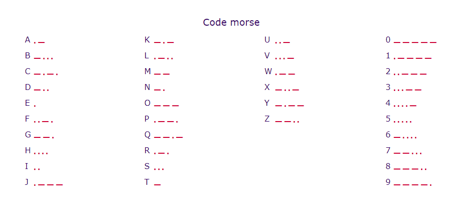

- Dans votre PC, il y a des fichiers qui sont cachés un peu partout. Pour ce challenge, vous allez devoir déchiffrer le code morse pour savoir quelle est la ligne de commande à exécuter à fin de trouver les fichiers. Chaque fichier est une étape et il contient la prochaine ligne de commande.

- Toutes les éprouves doivent commencer dans le dossier courant, et après chaque ligne de commande que vous allez déchiffrer en morse, vous allez ajouter /eprouve.txt .

- Voici une aide : 


- Voici la première ligne de commande : 

```
−·−· ·− −  −− −−− ·−· ··· · −··−· ·· − · −− ····− −··−· ·· − · −− ·−−−− 
```